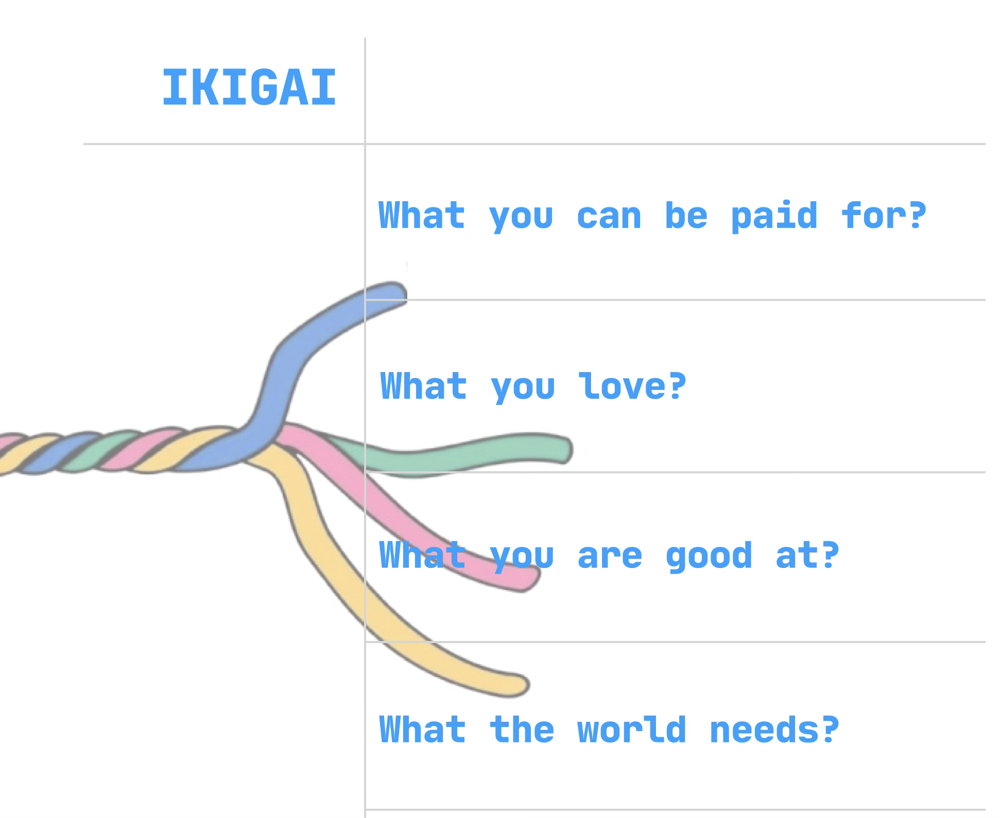

# Product philosophy：Ikigai

<figure><figcaption></figcaption></figure>

At WorkWork, our product philosophy is deeply inspired by the philosophy of knotting in Okinawa, Japan of Ikigai (生き甲斐), which translates to "a reason for being" or "a sense of purpose in life."&#x20;

Ikigai is the intersection of four essential elements:&#x20;

* What you love.
* What you are good at.
* What the world needs.
* What you can be paid for.&#x20;

This powerful concept guides us in designing a platform that empowers individuals to align their passions and skills with the global needs of the digital economy.

<figure><figcaption></figcaption></figure>

At the core of WorkWork's vision is the idea that true freedom in the modern work landscape comes from having the ability to choose how and where you work, while ensuring that you create meaningful value for both yourself and the broader world. We believe that by providing the tools, resources, and community support, WorkWork enables users to discover their Ikigai and, in turn, create sustainable income streams that align with their life goals.

Our platform is not just about finding a job or completing a project—it’s about helping you build a career that fuels your passion and drives you toward personal fulfillment. Whether you're a digital nomad, super individual, or remote worker, WorkWork provides a space where you can grow, collaborate, and monetize your unique skills while contributing to the global community.

We combine AI and crypto technologies to ensure a seamless experience, enabling remote work, cross-border payments, and decentralized collaboration. By empowering our users to reach their highest potential, WorkWork is designed to help you find your purpose and make your passions work for you.

Through the lens of Ikigai, WorkWork is here to help you connect with opportunities that not only match your expertise but also allow you to lead a balanced and fulfilling life, where your work aligns with your deepest passions and values.
